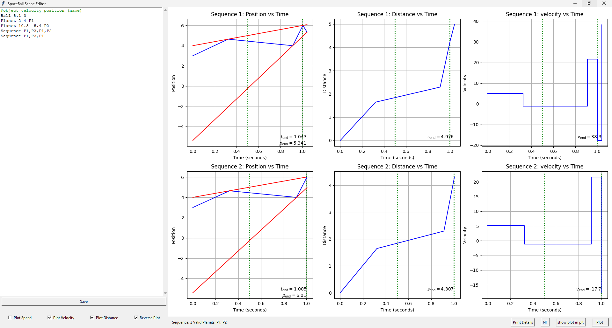

After installing the necessary libraries with:
```
pip install -r requirements.txt
```
The program can be started in two modes, either in the editor with:
```
Python main.py editor /scene/example.scene
```
which opens an editor window which lets you adjust the scene while plotting:


Or in plot mode, which simply plots the scene:
```
Python main.py plot /scene/example.scene 
```

in either options more details can be printed with the 'print details' button or the '-p' option respectively.

To further specify the parameters for the plot there are the following parameters:
```
--speed, -s for plotting the speed over the time of the sequence.
--velocity -v for plotting the velocity over the time of the sequence.
--distance, -d for plotting the distance the ball traveled over the sequence.
--reverse, -r for reversing the plot axis, if the flag is set different sequences are shown beneath each other. 
--maxy, -my defines a maximum y that is plotted in the default graph.
-ly, --miny defines a minimum y that is plotted in the defualt graph.
--highlightx, -x a repeatable argument that allows for the highlighting of x values in all plots.
```

```
Python main.py plot /scene/example.scene -r -v -d -x 0.5 -x 1 
```


Furthermore the option -e allows for the setting of an epsilon that must be between collisions, this can be set to 0 to allow the ball to collide twice or more with the same planet at once.
This can also be set to regulate float imprecision, which might allow for otherwise impossible collisions.

The Scene format is build by specifying one object in each line.
One can specify one ball, several planets and several sequences, it also allows for different coloring.
For the colors all default colors from the matplotlib are available. 
To define the ball or any Planet, it is required to specify the velocity and position separated with a space.
For the Planet a name and the color can be added afterwards.
A sequence is specified with the names of planets separated by commas.

An example scene could look like this:
```
Ball 5.1 3
Planet 2 4 P1 green
Planet 10.3 -5.4 P2 orange
Sequence P1,P2,P1,P2
Sequence P1,P2,P1
```